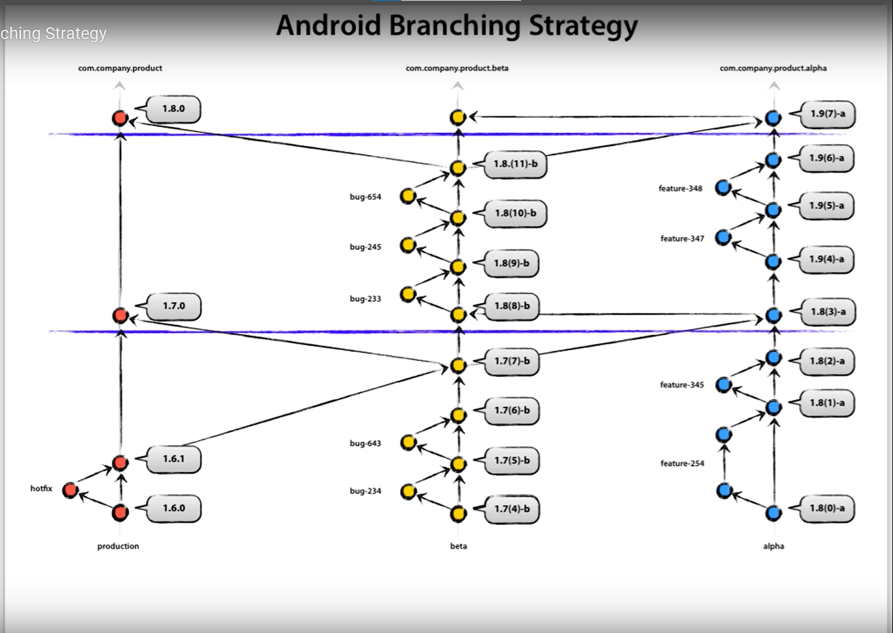

# :sparkles: EpileARN

Children need to learn science differently. EpileARn can give another vision of education and allow students to better understand the world around us.

She/he is building a team of cutting edge experts to help them on this gigantic task: You !

## 📄 Instructions

Delivery method: Github

For get more informations about github workflow strategy, following this link: https://nickskelton.medium.com/iframe-width-420-height-315-src-https-www-youtube-com-embed-fm3d7byzlic-8a81158c1110

Language:

- C# (Unity/AR)

## 👥 Members

- _GARRIDO Lilian_
- _LEAL Tom_
- _THOMAS Loic_
- _TAQUET Erwan_
- _SALEON-TERRAS Joseph_

## 🧱 Project Organisation

### Trello

- https://trello.com/b/XWLjybmj/t-vir-901

### Commits

We are following the [gitmoji convention](https://gitmoji.dev/).

Convention: ${Gitmoji} ${Verb or actions}/${More informations}

Exemple:

- ✨ Introduce/PrefabForPlanet
- 🔥 Remove/PrefabMars

### Branches

- Feature/Mars: To Delete
- main: Protected branch, not allowed to push, merge, deploys to production
- dev: Protected branch, staging branch to link between other branch and main
- beta_test: main: Protected branch, not allowed to push, deploys to BetaTest
- new branches: ${Concerned part}/${More Informations}
  Exemple: Unity/RouteForUsers

### Merge request and review

If you followed all the requirements above, the easier to read and review your merge requests (MR) will be therefore the faster they will be werged.

Once you consider your branch ready to be merged, create a new MR and assign your lead for a review.

If your MR does not meet the requirements above, they will not be merged and comments will be added for you to fix the line/file concerned. The easiest way to fix the issue is to checkout the concerned branch, commit your fix and push.

### Coding style

For Unity Project :

- Define the other function above start and update function
- Comment each function other start and update

## 🗃️ Resources

- https://developer.vuforia.com/
- https://docs.unity3d.com/Manual/index.html
- https://git-lfs.github.com/
